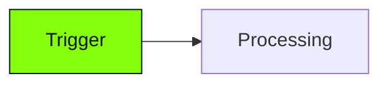

# Global Mermaid Chart Generator

Generate a Mermaid architecture diagram that is flexible, stylized, and ready to be used in social media posts, documentation, or generic markdown files.

## Output Format

Always output the result as a raw markdown ````mermaid` code block directly in the chat, AND an HTML snippet wrapping the mermaid block that applies the Atherial diagonal background texture behind the chart. This allows the user to easily screenshot the rendered preview in Cursor for use on social media.

Do not use an `%%{init: ...}%%` block. We rely on the `classDef` definitions to style the nodes, which ensures compatibility with various renderers while maintaining the brand aesthetic.

## Step 1 — Gather Context

Before generating the diagram, ask the user:
1. **What is the system or process?** (What triggers it? What are the main steps? What is the output?)
2. **What is the context?** (Is this for a social post? A technical doc? This determines how simplified the labels should be.)

## Step 2 — Apply Node Color Classes (Atherial Brand)

Every chart must end with these classDef declarations and class assignments.

```mermaid
classDef inputStyle fill:#85ff0a,stroke:#00140a,color:#00140a
classDef outputStyle fill:#1f1f1f,stroke:#fefffa,stroke-width:1px,color:#fefffa
classDef coreStyle fill:#faffeb,stroke:#00140a,color:#00140a

class [trigger/user node] inputStyle
class [final output node] outputStyle
class [agent/core processing node] coreStyle
```

| Role | Color | Use on |
|------|-------|--------|
| `inputStyle` | Accent green (#85ff0a) | The human, the trigger, the starting point |
| `outputStyle` | Dark (#1f1f1f) | The final output, the external delivery system |
| `coreStyle` | Off-white (#faffeb) | The agent brain, the core processing node |

## Step 3 — Background Texture (For Social Screenshots)

To make the diagram ready for social media screenshots, wrap the markdown code block in an HTML `div` that applies the Atherial diagonal stripe background texture and padding. 

Output exactly this format to the user:

<div style="background-color: #FEFFFA; background-image: repeating-linear-gradient(45deg, transparent, transparent 2px, rgba(0, 0, 0, 0.02) 2px, rgba(0, 0, 0, 0.02) 4px); padding: 40px; border-radius: 8px; border: 1px solid #E0E0E0;">



</div>

## Diagram Quality Rules

- **Keep labels short:** 2-5 words per line, max 2 lines. Use `<br/>` for line breaks, never `\n`.
- **Name integrations specifically:** "Instantly", "Supabase" instead of "Email Tool", "Database".
- **Avoid edge labels:** `-->|text|` can render poorly on some platforms. Let the nodes and flow direction speak for themselves.
- **LR for loops, TB for pipelines:** LR reads naturally when there is back-and-forth. TB reads naturally when data flows in one direction.
- **Simplify for Social:** If the user specifies this is for social media, reduce the number of subgraphs and focus on the highest-impact nodes. Do not overwhelm the viewer.